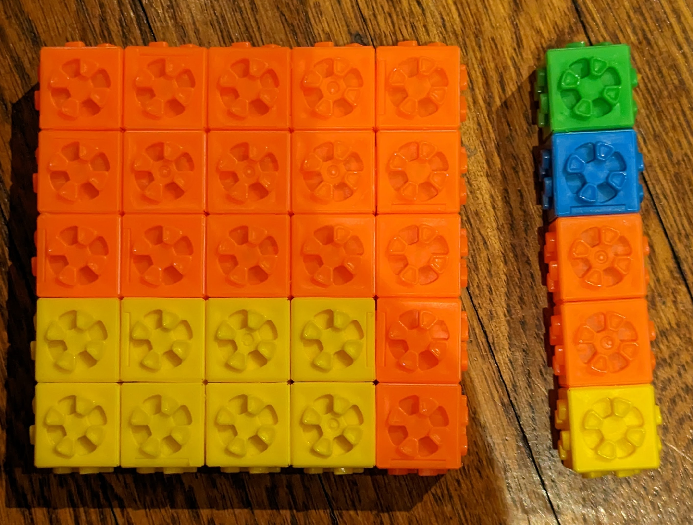

# mathnotes
Hi - nothing to see here, I'm just collecting a few notes from things I liked.

Why? Well, I'm a CS professor who's always been a little spotty about math. Probability and randomized algorithms? Bring it on! Long division or the gradeschool multiplication algorithm? Well, er...

And the problem is: I have kids now. And I lack a broad foundation of knowledge about teaching math to kids.

So, I'm taking notes.

## Mental approximation of $\sqrt{x}$

I really liked this post that I noticed from the orange site: https://gregorygundersen.com/blog/2023/02/01/estimating-square-roots/

It discusses Heron's method for approximating $\sqrt{x}$: pick a close guess, g, and then choose avg(g, x/g). For example, let's estimate the square root of 30. We'll start by picking 5 as a "close enough" guess, since $5^2 = 25$:

$$\sqrt{30} \approx avg(5, \frac{30}{5}) = avg(5,6) = 5.5$$

(true answer 5.47).

But what I particularly enjoyed about the post was that, in presenting the Taylor series expansion of $\sqrt{x} \approx \sqrt{a} + \frac{x-a}{2 \sqrt{a}}$, it reminds us that we don't need to do the full division as naively presented in Heron's method. This is obvious but it's nice to be up front about it when teaching it.

Example: Find $\sqrt{150}$

Pick 12 as a familiar starting point. $12^2 = 144$, so:

$$\sqrt{150} \approx 12 + \frac{150-144}{2*12} = 12 + \frac{3}{12} = 12 + \frac{1}{4} = 12.25$$

Pretty close to the true value of 12.247.

Elegant. And it admits a nice visual/physical interpretation for the 5yo too:

5*5 is 25, but that leaves 5 left over. 5/5 is 1, but if you add one to the sqrt it's too much - you want to add half.
